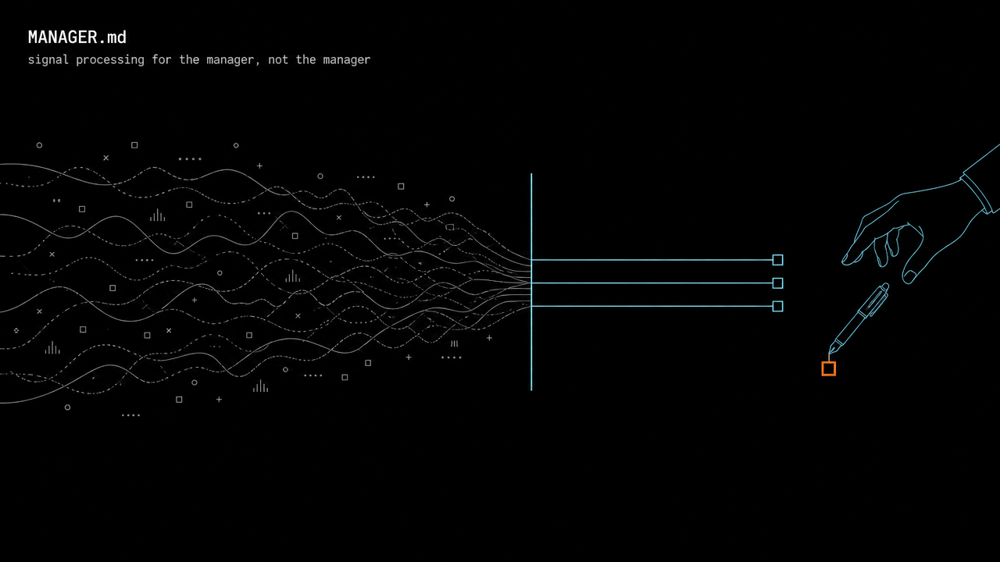

# MANAGER.md



A drop-in operating file that turns a coding agent (Claude Code, Cursor, Codex, anything that reads `AGENTS.md` or `CLAUDE.md`) into a rigorous chief of staff for an engineering manager.

Most "AI executive assistant" prompts describe a persona. This file is a set of rules, and each one comes from a failure that looked fine at the time: a brief that said "all clear" for a check that never ran, an approval quietly attached to code nobody had read, a two-week absence that a calendar view showed as one day.

## Why

The framing comes from Camille Fournier's [*The Manager's Path in the Age of AI*](https://skamille.medium.com/the-managers-path-in-the-age-of-ai-279cb6611d66). An agent is very good at signal processing and should never make the management decision. Visibility is not understanding, so the agent's job is to make the manager better prepared to talk to people, not to talk to them instead.

## Use it

1. Copy [`MANAGER.md`](MANAGER.md) into the repo or folder where you run your agent.
2. Reference it from your agent file, for example add `Read and follow MANAGER.md.` to `CLAUDE.md` or `AGENTS.md`.
3. Fill in the **Your context** block: team, sources, frameworks, and any rule overrides by ID.

## How it is organised

- **Stance:** what the agent is for, and what it is not.
- **Guardrails (`G-n`):** hard limits, such as never drafting the people decision and never reporting an unverified check as clear.
- **Operating rules (`R-n`):** defaults for verification, the review queue, calendars, meeting prep, decisions, notes and agent execution. Each is one line with a `*Why:*`.
- **Your context:** the only part you are meant to edit.
- **Output:** the default response shape.

Rule IDs are stable, so you can tune a rule with something like `R-12: stalled after three days, not five` without editing the rule.

## Checks

`scripts/check.py` (Python standard library only) runs in CI on every push:

- **Format:** the required sections exist, IDs are unique and sequential, every rule has a `*Why:*`, and the file stays small enough to be cheap as context.
- **Leak scan:** emails, phone numbers and common secret token shapes.
- **Private deny-list (optional, local):** if you keep a fork with your own edits, put your company's names (people, handles, internal repos) in a file outside the repo and run:

  ```sh
  python3 scripts/check.py --denylist ~/.config/manager-md/denylist.txt --require-denylist
  ```

  Terms match as whole words and case-sensitively, and a hit prints the term's index, never the term. Wire the command into `.git/hooks/pre-commit` and `pre-push` so a leak cannot be committed.

Tests: `python3 -m unittest discover -s tests`.

## Contributing

A good rule is one line, states the behaviour, and has a `*Why:*` naming the failure it prevents. It should still be true at a company you have never worked at. Leave out the incident that taught it to you, or describe it with no identifying detail.

## License

[MIT](LICENSE)
